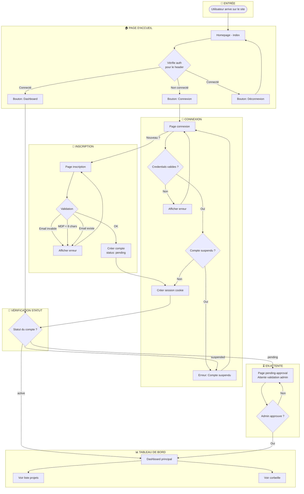
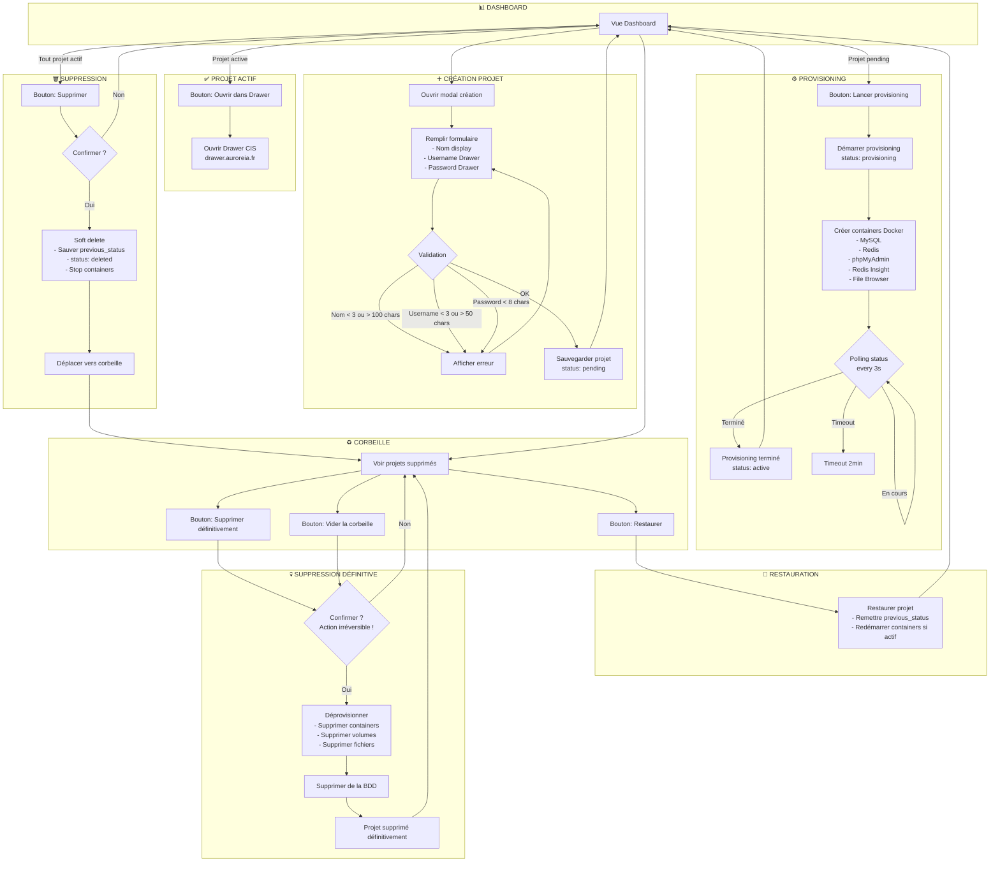
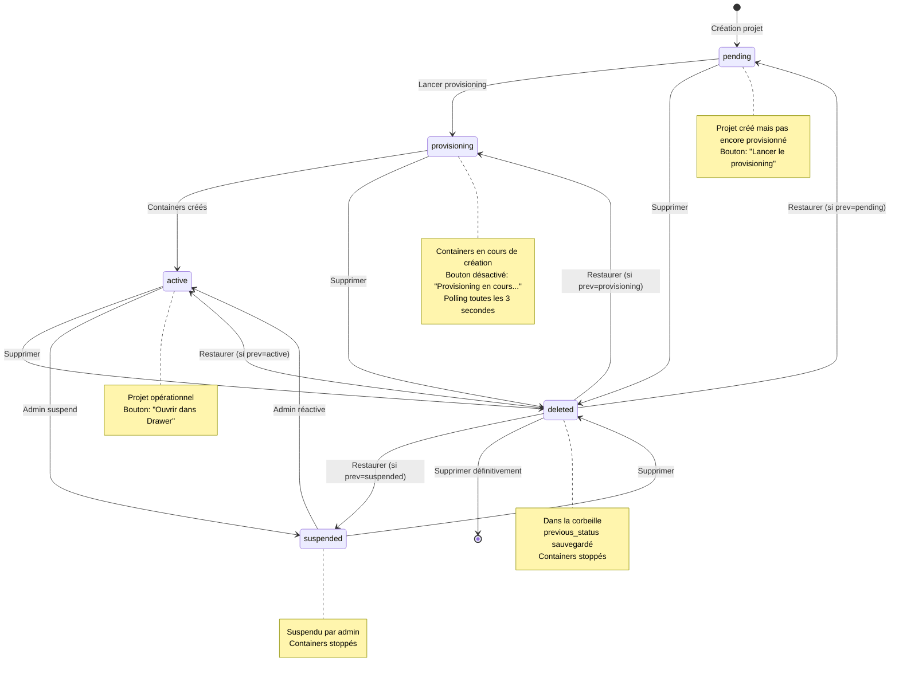
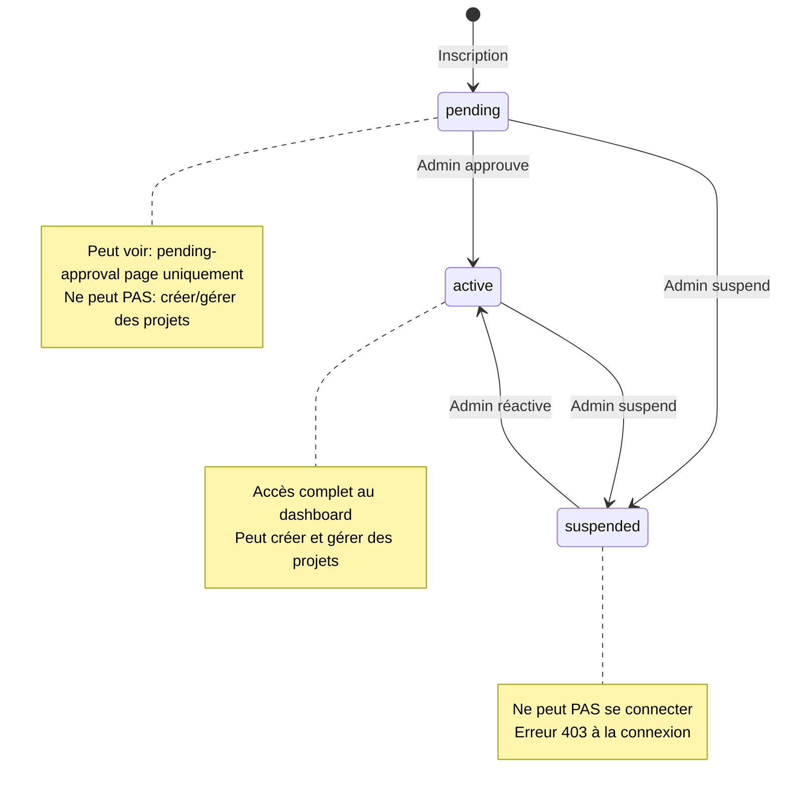
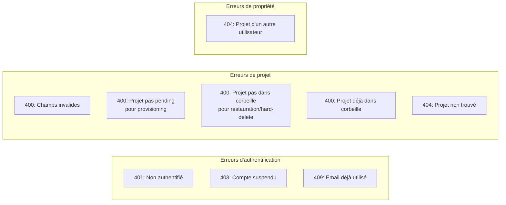

# Parcours Utilisateur - Gestion de Projets Auroreia

## Diagramme Principal de Flux

## Diagramme de Gestion des Projets

## Diagramme des États d'un Projet

## Diagramme des Statuts de Compte

## Tableau Récapitulatif des Actions

| Action | Endpoint | Pré-conditions | Résultat |
|--------|----------|----------------|----------|
| **Créer projet** | `POST /api/projects` | Compte actif | Projet créé (status: pending) |
| **Provisionner** | `POST /api/projects/:id/provision` | Projet pending, propriétaire | Containers Docker créés |
| **Ouvrir Drawer** | Lien externe | Projet active | Redirection vers drawer.auroreia.fr |
| **Supprimer** | `DELETE /api/projects/:id` | Projet pas dans corbeille | Déplacé en corbeille |
| **Restaurer** | `POST /api/projects/:id/restore` | Projet dans corbeille | Restauré à l'état précédent |
| **Suppr. définitive** | `POST /api/projects/:id/hard-delete` | Projet dans corbeille | Supprimé de la BDD + containers |
| **Vider corbeille** | Multiple hard-delete | Projets dans corbeille | Tous supprimés définitivement |

## Conditions d'Erreur

## Comment visualiser ces diagrammes

1. **VSCode** : Installer l'extension "Markdown Preview Mermaid Support"
2. **En ligne** : Copier le code dans [mermaid.live](https://mermaid.live)
3. **GitHub/GitLab** : Ces plateformes supportent nativement Mermaid dans les fichiers .md
