# Parcours Utilisateur - Gestion de Projets Auroreia

## Diagramme Principal de Flux

```mermaid
flowchart TD
    subgraph ENTREE["🚪 ENTRÉE"]
        START([Utilisateur arrive sur le site])
    end

    subgraph HOMEPAGE["🏠 PAGE D'ACCUEIL"]
        HOME[Homepage - index]
        HEADER_CHECK{Vérifie auth<br/>pour le header}
        BTN_LOGIN[Bouton: Connexion]
        BTN_DASHBOARD[Bouton: Dashboard]
        BTN_LOGOUT[Bouton: Déconnexion]
    end

    subgraph REGISTRATION["📝 INSCRIPTION"]
        REGISTER_PAGE[Page inscription]
        VALIDATE_REG{Validation}
        REG_ERROR[Afficher erreur]
        CREATE_ACCOUNT[Créer compte<br/>status: pending]
    end

    subgraph LOGIN["🔑 CONNEXION"]
        LOGIN_PAGE[Page connexion]
        VALIDATE_LOGIN{Credentials valides ?}
        LOGIN_ERROR[Afficher erreur]
        CHECK_SUSPENDED{Compte suspendu ?}
        SUSPENDED_ERROR[Erreur: Compte suspendu]
        CREATE_SESSION[Créer session cookie]
    end

    subgraph AUTH_CHECK["🔐 VÉRIFICATION STATUT"]
        CHECK_STATUS{Statut du compte ?}
    end

    subgraph PENDING["⏳ EN ATTENTE"]
        PENDING_PAGE[Page pending-approval<br/>Attente validation admin]
        WAIT_APPROVAL{Admin approuve ?}
    end

    subgraph DASHBOARD["📊 TABLEAU DE BORD"]
        DASHBOARD_PAGE[Dashboard principal]
        VIEW_PROJECTS[Voir liste projets]
        VIEW_TRASH[Voir corbeille]
    end

    %% Flux d'entrée - Homepage
    START --> HOME
    HOME --> HEADER_CHECK
    HEADER_CHECK -->|Non connecté| BTN_LOGIN
    HEADER_CHECK -->|Connecté| BTN_DASHBOARD
    HEADER_CHECK -->|Connecté| BTN_LOGOUT

    %% Actions depuis la homepage
    BTN_LOGIN --> LOGIN_PAGE
    BTN_DASHBOARD --> CHECK_STATUS
    BTN_LOGOUT --> HOME

    %% Flux inscription
    LOGIN_PAGE -->|Nouveau ?| REGISTER_PAGE
    REGISTER_PAGE --> VALIDATE_REG
    VALIDATE_REG -->|Email invalide| REG_ERROR
    VALIDATE_REG -->|MDP < 8 chars| REG_ERROR
    VALIDATE_REG -->|Email existe| REG_ERROR
    REG_ERROR --> REGISTER_PAGE
    VALIDATE_REG -->|OK| CREATE_ACCOUNT
    CREATE_ACCOUNT --> CREATE_SESSION
    CREATE_SESSION --> CHECK_STATUS

    %% Flux connexion
    LOGIN_PAGE --> VALIDATE_LOGIN
    VALIDATE_LOGIN -->|Non| LOGIN_ERROR
    LOGIN_ERROR --> LOGIN_PAGE
    VALIDATE_LOGIN -->|Oui| CHECK_SUSPENDED
    CHECK_SUSPENDED -->|Oui| SUSPENDED_ERROR
    SUSPENDED_ERROR --> LOGIN_PAGE
    CHECK_SUSPENDED -->|Non| CREATE_SESSION

    %% Vérification statut
    CHECK_STATUS -->|pending| PENDING_PAGE
    CHECK_STATUS -->|active| DASHBOARD_PAGE
    CHECK_STATUS -->|suspended| SUSPENDED_ERROR

    %% Attente approbation
    PENDING_PAGE --> WAIT_APPROVAL
    WAIT_APPROVAL -->|Non| PENDING_PAGE
    WAIT_APPROVAL -->|Oui| DASHBOARD_PAGE

    %% Dashboard
    DASHBOARD_PAGE --> VIEW_PROJECTS
    DASHBOARD_PAGE --> VIEW_TRASH
```

## Diagramme de Gestion des Projets

```mermaid
flowchart TD
    subgraph DASHBOARD["📊 DASHBOARD"]
        VIEW[Vue Dashboard]
    end

    subgraph CREATE["➕ CRÉATION PROJET"]
        OPEN_MODAL[Ouvrir modal création]
        FILL_FORM[Remplir formulaire<br/>- Nom display<br/>- Username Drawer<br/>- Password Drawer]
        VALIDATE_CREATE{Validation}
        CREATE_ERROR[Afficher erreur]
        SAVE_PROJECT[Sauvegarder projet<br/>status: pending]
    end

    subgraph PROVISION["⚙️ PROVISIONING"]
        BTN_PROVISION[Bouton: Lancer provisioning]
        START_PROVISION[Démarrer provisioning<br/>status: provisioning]
        CREATE_CONTAINERS[Créer containers Docker<br/>- MySQL<br/>- Redis<br/>- phpMyAdmin<br/>- Redis Insight<br/>- File Browser]
        POLL_STATUS{Polling status<br/>every 3s}
        PROVISION_COMPLETE[Provisioning terminé<br/>status: active]
        PROVISION_TIMEOUT[Timeout 2min]
    end

    subgraph ACTIVE["✅ PROJET ACTIF"]
        BTN_OPEN[Bouton: Ouvrir dans Drawer]
        OPEN_DRAWER[Ouvrir Drawer CIS<br/>drawer.auroreia.fr]
    end

    subgraph DELETE["🗑️ SUPPRESSION"]
        BTN_DELETE[Bouton: Supprimer]
        CONFIRM_DELETE{Confirmer ?}
        SOFT_DELETE[Soft delete<br/>- Sauver previous_status<br/>- status: deleted<br/>- Stop containers]
        MOVE_TRASH[Déplacer vers corbeille]
    end

    subgraph TRASH["♻️ CORBEILLE"]
        VIEW_TRASH[Voir projets supprimés]
        BTN_RESTORE[Bouton: Restaurer]
        BTN_HARD_DELETE[Bouton: Supprimer définitivement]
        BTN_EMPTY_TRASH[Bouton: Vider la corbeille]
    end

    subgraph RESTORE["🔄 RESTAURATION"]
        RESTORE_PROJECT[Restaurer projet<br/>- Remettre previous_status<br/>- Redémarrer containers si actif]
    end

    subgraph HARD_DELETE["💀 SUPPRESSION DÉFINITIVE"]
        CONFIRM_HARD{Confirmer ?<br/>Action irréversible !}
        DEPROVISION[Déprovisionner<br/>- Supprimer containers<br/>- Supprimer volumes<br/>- Supprimer fichiers]
        DELETE_DB[Supprimer de la BDD]
        GONE[Projet supprimé définitivement]
    end

    %% Flux création
    VIEW --> OPEN_MODAL
    OPEN_MODAL --> FILL_FORM
    FILL_FORM --> VALIDATE_CREATE
    VALIDATE_CREATE -->|Nom < 3 ou > 100 chars| CREATE_ERROR
    VALIDATE_CREATE -->|Username < 3 ou > 50 chars| CREATE_ERROR
    VALIDATE_CREATE -->|Password < 8 chars| CREATE_ERROR
    CREATE_ERROR --> FILL_FORM
    VALIDATE_CREATE -->|OK| SAVE_PROJECT
    SAVE_PROJECT --> VIEW

    %% Flux provisioning
    VIEW -->|Projet pending| BTN_PROVISION
    BTN_PROVISION --> START_PROVISION
    START_PROVISION --> CREATE_CONTAINERS
    CREATE_CONTAINERS --> POLL_STATUS
    POLL_STATUS -->|En cours| POLL_STATUS
    POLL_STATUS -->|Timeout| PROVISION_TIMEOUT
    POLL_STATUS -->|Terminé| PROVISION_COMPLETE
    PROVISION_COMPLETE --> VIEW

    %% Flux projet actif
    VIEW -->|Projet active| BTN_OPEN
    BTN_OPEN --> OPEN_DRAWER

    %% Flux suppression
    VIEW -->|Tout projet actif| BTN_DELETE
    BTN_DELETE --> CONFIRM_DELETE
    CONFIRM_DELETE -->|Non| VIEW
    CONFIRM_DELETE -->|Oui| SOFT_DELETE
    SOFT_DELETE --> MOVE_TRASH
    MOVE_TRASH --> VIEW_TRASH

    %% Flux corbeille
    VIEW --> VIEW_TRASH
    VIEW_TRASH --> BTN_RESTORE
    VIEW_TRASH --> BTN_HARD_DELETE
    VIEW_TRASH --> BTN_EMPTY_TRASH

    %% Flux restauration
    BTN_RESTORE --> RESTORE_PROJECT
    RESTORE_PROJECT --> VIEW

    %% Flux suppression définitive
    BTN_HARD_DELETE --> CONFIRM_HARD
    BTN_EMPTY_TRASH --> CONFIRM_HARD
    CONFIRM_HARD -->|Non| VIEW_TRASH
    CONFIRM_HARD -->|Oui| DEPROVISION
    DEPROVISION --> DELETE_DB
    DELETE_DB --> GONE
    GONE --> VIEW_TRASH
```

## Diagramme des États d'un Projet

```mermaid
stateDiagram-v2
    [*] --> pending: Création projet

    pending --> provisioning: Lancer provisioning
    provisioning --> active: Containers créés

    pending --> deleted: Supprimer
    provisioning --> deleted: Supprimer
    active --> deleted: Supprimer
    suspended --> deleted: Supprimer

    deleted --> pending: Restaurer (si prev=pending)
    deleted --> provisioning: Restaurer (si prev=provisioning)
    deleted --> active: Restaurer (si prev=active)
    deleted --> suspended: Restaurer (si prev=suspended)

    deleted --> [*]: Supprimer définitivement

    active --> suspended: Admin suspend
    suspended --> active: Admin réactive

    note right of pending
        Projet créé mais pas encore provisionné
        Bouton: "Lancer le provisioning"
    end note

    note right of provisioning
        Containers en cours de création
        Bouton désactivé: "Provisioning en cours..."
        Polling toutes les 3 secondes
    end note

    note right of active
        Projet opérationnel
        Bouton: "Ouvrir dans Drawer"
    end note

    note right of deleted
        Dans la corbeille
        previous_status sauvegardé
        Containers stoppés
    end note

    note right of suspended
        Suspendu par admin
        Containers stoppés
    end note
```

## Diagramme des Statuts de Compte

```mermaid
stateDiagram-v2
    [*] --> pending: Inscription

    pending --> active: Admin approuve
    pending --> suspended: Admin suspend

    active --> suspended: Admin suspend
    suspended --> active: Admin réactive

    note right of pending
        Peut voir: pending-approval page uniquement
        Ne peut PAS: créer/gérer des projets
    end note

    note right of active
        Accès complet au dashboard
        Peut créer et gérer des projets
    end note

    note right of suspended
        Ne peut PAS se connecter
        Erreur 403 à la connexion
    end note
```

## Tableau Récapitulatif des Actions

| Action | Endpoint | Pré-conditions | Résultat |
|--------|----------|----------------|----------|
| **Créer projet** | `POST /api/projects` | Compte actif | Projet créé (status: pending) |
| **Provisionner** | `POST /api/projects/:id/provision` | Projet pending, propriétaire | Containers Docker créés |
| **Ouvrir Drawer** | Lien externe | Projet active | Redirection vers drawer.auroreia.fr |
| **Supprimer** | `DELETE /api/projects/:id` | Projet pas dans corbeille | Déplacé en corbeille |
| **Restaurer** | `POST /api/projects/:id/restore` | Projet dans corbeille | Restauré à l'état précédent |
| **Suppr. définitive** | `POST /api/projects/:id/hard-delete` | Projet dans corbeille | Supprimé de la BDD + containers |
| **Vider corbeille** | Multiple hard-delete | Projets dans corbeille | Tous supprimés définitivement |

## Conditions d'Erreur

```mermaid
flowchart LR
    subgraph AUTH_ERRORS["Erreurs d'authentification"]
        E1[401: Non authentifié]
        E2[403: Compte suspendu]
        E3[409: Email déjà utilisé]
    end

    subgraph PROJECT_ERRORS["Erreurs de projet"]
        E4[400: Champs invalides]
        E5[400: Projet pas pending<br/>pour provisioning]
        E6[400: Projet pas dans corbeille<br/>pour restauration/hard-delete]
        E7[400: Projet déjà dans corbeille]
        E8[404: Projet non trouvé]
    end

    subgraph OWNERSHIP["Erreurs de propriété"]
        E9[404: Projet d'un autre utilisateur]
    end
```

## Comment visualiser ces diagrammes

1. **VSCode** : Installer l'extension "Markdown Preview Mermaid Support"
2. **En ligne** : Copier le code dans [mermaid.live](https://mermaid.live)
3. **GitHub/GitLab** : Ces plateformes supportent nativement Mermaid dans les fichiers .md
